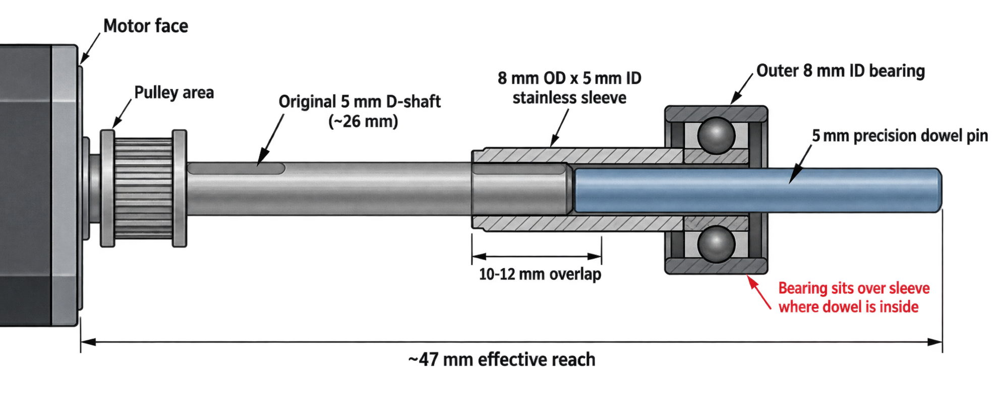

# ZeroG Stepper Double-Shear Shaft Extension

> Experimental note: this is not a standard ZeroG, Monolith, or Voron method.
> It is a proposed shaft-extension approach for short-shaft NEMA 17 steppers and
> has not been validated with long-term printer runtime. Treat the calculations
> below as assumptions and rough comparison work, not certified mechanical design.

## Goal

Some ZeroG-style double-shear motor arrangements want an effective shaft reach of
about 47 mm, but common NEMA 17 motors such as the StepperOnline
`17HS19-2004S1` have a 5 mm D-shaft that is only about 26 mm long.

This note documents a proposed way to extend the shaft while also giving the
outer support bearing an 8 mm surface to run on:

- Motor: StepperOnline `17HS19-2004S1`, 5 mm D-shaft, about 26 mm long
- Target effective shaft reach: about 47 mm from the motor face
- Sleeve: 8 mm OD x 5 mm ID stainless tube or bushing
- Extension: 5 mm precision dowel pin
- Suggested sleeve overlap on existing motor shaft: about 10-12 mm
- Retaining compound: Loctite 638 or Loctite 648
- Outer support bearing: 8 mm ID bearing placed over the sleeved section

## Concept

The stainless sleeve bridges the original motor shaft and the dowel extension.
The 5 mm dowel continues the shaft inside the sleeve, while the sleeve presents
an 8 mm outside diameter for the outer bearing.



## Assembly Notes

The assembly order matters because retaining compound can trap air or hydraulic
pressure inside a close-fitting sleeve.

1. Deburr and clean the motor shaft, sleeve bore, and dowel pin.
2. Dry-fit the sleeve on the motor shaft and the dowel in the sleeve.
3. If the tube is too tight, deburr first. If it still will not slip on
   controllably, use a sharp 5.02 mm hand reamer to create a controlled slip fit.
4. Apply Loctite 638 or 648 to the motor shaft and inside the near end of the
   sleeve.
5. Fit the sleeve onto the motor shaft first, targeting about 10-12 mm overlap.
6. Wipe excess retaining compound before it reaches the bearing surface.
7. Apply retaining compound to the dowel and the open end of the sleeve.
8. Insert the dowel into the sleeve after the sleeve is already on the motor
   shaft, allowing displaced air and excess compound to escape from the open end.
9. Let the retaining compound cure fully before installing belts or applying
   radial load.

Avoid bonding the dowel into the sleeve first and then pressing the combined
part onto the motor shaft. That can trap air and compound in the blind interface
and make the parts stop short of their intended position.

## Bearing Placement

Place the outer 8 mm bearing over the section of sleeve where the 5 mm dowel pin
is inside the sleeve. Do not place the bearing outboard of the dowel-supported
region.

The sleeve should be treated as a composite section: stainless tube plus 5 mm
steel core. The bearing load should land on the fully supported part of that
section.

## Stiffness Comparison

> **Unvalidated model:** these calculations are a rough comparative beam model,
> not a certified design or test result. The 100 N load is an example load, not
> a claim about actual ZeroG belt load. Deflection and stress scale approximately
> linearly, so a 50 N load would produce about half the tabulated values.

The original comparison used these assumptions:

- Existing motor shaft: 5 mm diameter x 26 mm long
- Comparison shaft: continuous 5 mm diameter x 47 mm long
- Extension required for the model: 21 mm
- Sleeve: 8 mm OD x 5 mm ID, modeled as 304 stainless steel
- Sleeve start: 16, 18, or 20 mm from the motor face
- Primary proposed geometry: sleeve starts at 16 mm, giving 10 mm overlap
- Dowel starts at the end of the original shaft
- Outer support bearing centered near 47 mm from the motor face
- Pulley center about 12 mm from the motor face
- Approximate spacing between the stepper's internal bearings: 40 mm
- Example radial load at the pulley: 100 N

The current concept drawing labels a 20 mm dowel. With a measured 26 mm motor
shaft, that implies about 46 mm total reach; the original 47 mm calculation used
a 21 mm extension. Measure the actual motor shaft and required bearing location
before choosing or trimming the dowel.

| Arrangement | Pulley deflection at 100 N | Peak modeled bending stress |
|---|---:|---:|
| Continuous 5 mm x 47 mm shaft with double shear | **~12.0 micrometers** | **~47 MPa** |
| Solid 8 mm x 47 mm exposed shaft with double shear | **~2.75 micrometers** | **~16 MPa** |
| 8 x 5 mm sleeve starting at 16 mm | **~7.7 micrometers** | **~54 MPa** |
| 8 x 5 mm sleeve starting at 18 mm | ~8.6 micrometers | ~53 MPa |
| 8 x 5 mm sleeve starting at 20 mm | ~9.3 micrometers | ~52 MPa |

In this model, the proposed 10 mm-overlap arrangement produces about **36% less
pulley deflection** than a continuous 5 mm x 47 mm shaft. The sleeved region is
substantially stiffer because bending stiffness is strongly dependent on
diameter. A solid 8 mm shaft has:

```text
(8 / 5)^4 = 6.55
```

times the second moment of area of a solid 5 mm shaft. Accounting for the 304
stainless annulus and the 5 mm steel core, the modeled flexural rigidity of the
sleeved section is approximately **6.36 times** that of the bare 5 mm shaft.

### Solid 8 mm Shaft Reference

The solid 8 mm row uses the same 100 N load, pulley position, bearing positions,
steel modulus, and 47 mm external reach as the 5 mm baseline. It models a solid
8 mm shaft from the motor face to the outer support bearing while retaining the
original model's 5 mm shaft through the approximately 40 mm internal-bearing
span. This produces:

- Pulley deflection: approximately **2.75 micrometers**, about **77% less** than
  the continuous 5 mm x 47 mm baseline
- Peak bending stress: approximately **16 MPa**, about **66% less** than the
  5 mm baseline
- External-section second moment of area: **6.55 times** that of the 5 mm shaft
- External-section elastic section modulus: `(8 / 5)^3 = 4.096` times that of
  the 5 mm shaft

For completeness, an idealized 8 mm shaft through the entire model, including
the span between the stepper's internal bearings, gives approximately **1.83
micrometers** of pulley deflection and **11.5 MPa** peak bending stress. That is
not a drop-in comparison for the existing motor because its internal shaft and
bearings are designed around a 5 mm shaft; it is included only as a theoretical
upper-bound reference.

The model predicts slightly higher peak stress in the unsleeved 5 mm region for
the sleeved versions. The stiffer outer section changes the reactions in the
three-bearing system, so the outer support carries more load and the bending
moment near the pulley rises slightly. The predicted values remain modest for a
steel motor shaft, but material grade, stress concentrations, fatigue, and the
D-flat were not modeled in detail.

### Retaining-Compound Joint Estimate

With 10 mm of overlap on a 5 mm shaft, the nominal cylindrical bonding area is:

```text
pi x 5 mm x 10 mm = approximately 157 mm^2
```

The original beam model estimated approximately **0.4 N m** of bending moment
through the sleeve near the splice under the example 100 N pulley load. A crude,
conservative conversion placed the average adhesive stress below **1 MPa**.
This suggests useful nominal static margin for Loctite 638 or 648, but it is not
a safety-factor calculation. The D-flat reduces actual bond area, and cyclic
bending, peel stress, fit clearance, surface preparation, stainless passivation,
temperature, cure conditions, and adhesive age can dominate real joint life.

These calculations do not establish fatigue life, adhesive durability, runout,
bearing fit, concentricity, or printer reliability. The central experiment is
whether the three-part assembly can run concentrically without loading or
binding the outer bearing.

## Main Risks

- Runout from imperfect concentricity between the motor shaft, sleeve, and dowel
- Tube OD tolerance being unsuitable for the bearing fit
- Sleeve ID tolerance being too loose or too tight for reliable retaining-compound bonding
- Weak bond from poor cleaning, insufficient cure time, or excess gap
- D-shaft flat reducing bond area on the original motor shaft
- Bearing load landing outside the dowel-supported sleeve section
- Belt tension or pulley position differing from the assumptions used here

## Validation Checklist

Before installing in a printer:

- Confirm the sleeve OD is appropriate for the actual 8 mm bearing fit.
- Confirm the sleeve slides on with a controlled slip fit after deburring.
- Confirm the dowel has a controlled slip fit in the sleeve.
- Verify the assembled shaft reaches about 47 mm from the motor face.
- Verify at least about 10-12 mm sleeve overlap on the original shaft.
- Check visible runout with a dial indicator if available.
- Spin the bearing on the sleeved section by hand and feel for tight spots.
- Confirm the pulley still clamps securely to the intended shaft section.
- Let Loctite 638 or 648 cure fully before tensioning belts.
- Start with conservative belt tension and re-check runout, bearing feel, and
  any witness marks after early runtime.

## Status

This is a candidate method for experimenters who already understand the risks of
modifying a stepper shaft support arrangement. The more conventional solutions
remain using a proper long-shaft motor or a published ZeroG/Monolith-compatible
short-shaft double-shear arrangement that does not rely on a bonded shaft
extension.
